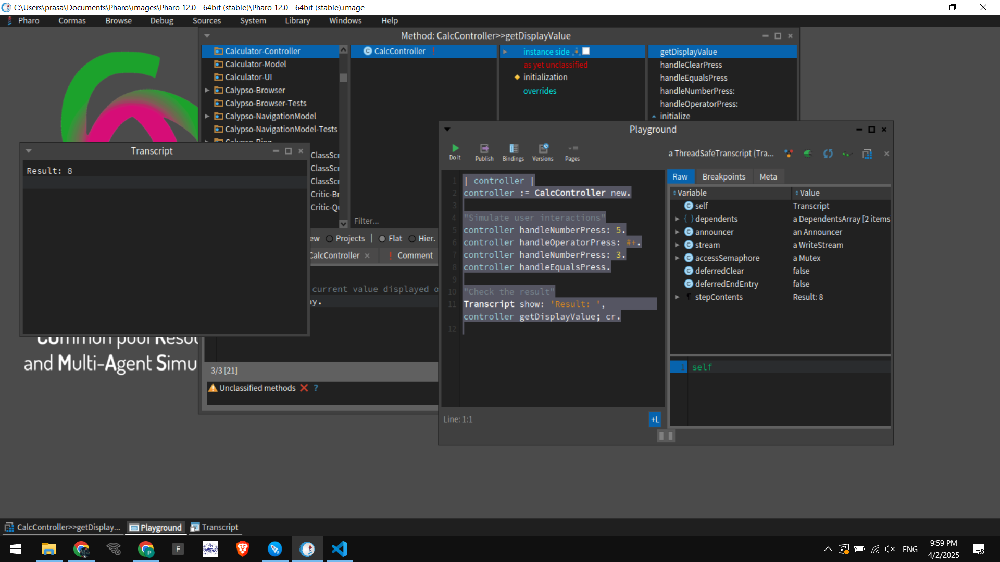
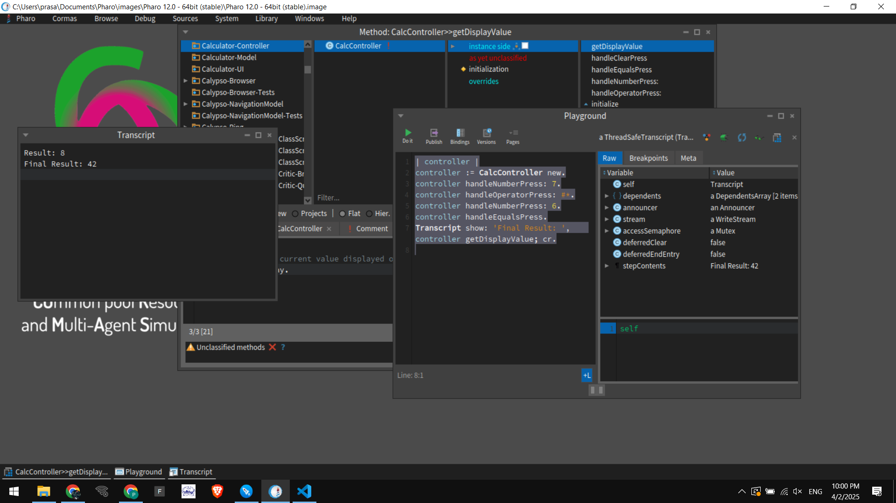
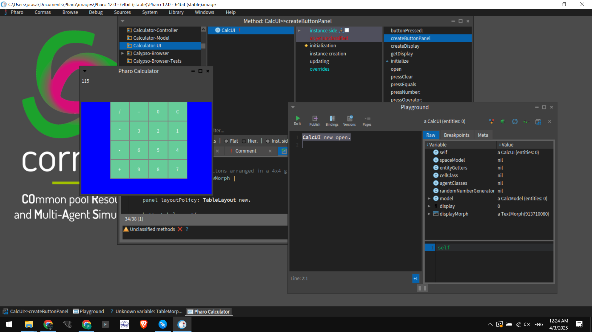

# Building a Dynamic Calculator in Pharo: From Core Logic to a Full-Fledged GUI

_Pharo Smalltalk has long been celebrated for its dynamic, live programming environment, which makes it a fantastic platform for exploring and building object-oriented projects. In this post, we'll take a deep dive into the creation of a simple calculator, starting from its core arithmetic logic and extending it into a rich graphical user interface (GUI) using Pharo's Morphic framework._

---

## Introduction

Calculators are more than just a tool to perform arithmetic—they serve as an excellent learning exercise in software design. They encompass a wide array of programming concepts:
- **Arithmetic operations:** Handling addition, subtraction, multiplication, and division.
- **State management:** Keeping track of user input and results.
- **Event handling:** Responding to button clicks and user actions.
- **Graphical interfaces:** Creating interactive, visually appealing UIs.

In this project, we developed two versions of the calculator:

1. **Non-UI Version:**  
   A straightforward implementation that focuses solely on the core logic and the command-driven interface.
2. **UI Version:**  
   A more advanced iteration that brings the calculator to life with a graphical interface mimicking a real-world calculator.

Both versions follow the **Model-View-Controller (MVC)** architecture, ensuring a clean separation of concerns, which makes the code more maintainable and scalable.

---

## Why Pharo Smalltalk?

Pharo is an open-source, modern Smalltalk environment that encourages experimentation. Its powerful live coding capabilities and reflective architecture allow developers to:
- Modify running code without restarting the system.
- Explore and manipulate the object graph in real time.
- Build applications that are both dynamic and robust.

The calculator project is a perfect example of how these features come together to facilitate rapid development and clear design.

---

## Project Structure and Design

### MVC Architecture

The project is split into three main components:

- **Model (`CalcModel`):**  
  This component encapsulates the core logic. It handles storing values, applying operations, and computing results.
  
- **Controller (`CalcController`):**  
  The controller acts as the bridge between the model and the user. It processes user inputs, invokes the model’s methods, and retrieves results.

- **View (`CalcUI`):**  
  Present in the UI version, the view is responsible for rendering the interface. It displays the calculator's output and provides a grid of buttons for user interaction.

### Directory Layout

The project is organized as follows:

```
Calculator-Model/        # Core arithmetic logic (CalcModel)
Calculator-Controller/    # Handles user interactions (CalcController)
Calculator-UI/            # (UI version only) Graphical interface code (CalcUI)
```

This separation allows you to work on the core functionality independently of the user interface, facilitating easier testing and maintenance.

---

## Deep Dive into the Implementation

### 1. The Non-UI Version: Core Logic and Command-Driven Operation

#### **CalcModel: The Heart of the Calculator**

The `CalcModel` class is designed to perform arithmetic calculations. It maintains three essential pieces of information:
- **Current Value:** The number currently being entered or computed.
- **Previous Value:** The last stored number before an operation.
- **Operator:** The arithmetic operation selected (e.g., `+`, `-`, `*`, or `/`).

Here's how it works:

```smalltalk
CMAbstractModel << #CalcModel
    slots: { #currentValue. #previousValue. #operator };
    package: 'Calculator-Model'.

CalcModel >> initialize
    "Initialize default values"
    currentValue := 0.
    previousValue := 0.
    operator := nil.

CalcModel >> setOperator: anOperator
    "Set the operator (+, -, *, /) and store the previous value"
    operator := anOperator.
    previousValue := currentValue.
    currentValue := 0.

CalcModel >> updateValue: aNumber
    "Append a digit to the current value"
    currentValue := (currentValue * 10) + aNumber.

CalcModel >> computeResult
    "Compute the result based on the stored operator"
    operator ifNotNil: [
        currentValue := (operator = #+) ifTrue: [previousValue + currentValue]
                     ifFalse: [(operator = #-) ifTrue: [previousValue - currentValue]
                     ifFalse: [(operator = #*) ifTrue: [previousValue * currentValue]
                     ifFalse: [(operator = #/) ifTrue: [previousValue / currentValue]
                     ifFalse: [currentValue]]]].
        operator := nil.
    ].

CalcModel >> clear
    "Reset calculator"
    currentValue := 0.
    previousValue := 0.
    operator := nil.

CalcModel >> getCurrentValue
    "Get the current value for display"
    ^ currentValue.
```

This class not only illustrates core arithmetic processing but also demonstrates the power of message passing in Smalltalk.

#### **CalcController: Bridging Input with Logic**

The `CalcController` class handles user commands by communicating with the `CalcModel`. Whether the input comes from a Playground script or a more sophisticated user interface, the controller ensures the right methods are called on the model.

```smalltalk
CMAbstractModel << #CalcController
    slots: { #model };
    package: 'Calculator-Controller'.

CalcController >> initialize
    "Initialize the controller with a model instance."
    model := CalcModel new.

CalcController >> handleNumberPress: aNumber
    "Handle number button press and update model."
    model updateValue: aNumber.

CalcController >> handleOperatorPress: anOperator
    "Handle operator button press and update model."
    model setOperator: anOperator.

CalcController >> handleEqualsPress
    "Handle equals button press and compute the result."
    model computeResult.

CalcController >> handleClearPress
    "Handle clear button press to reset the calculator."
    model clear.

CalcController >> getDisplayValue
    "Retrieve the current value displayed on the calculator."
    ^ model getCurrentValue.
```

#### **Testing the Non-UI Version**

Testing is simple in Pharo. You open the Playground, paste the following code, and observe the result in the Transcript:

```smalltalk
| controller |
controller := CalcController new.

controller handleNumberPress: 5.
controller handleOperatorPress: #+.
controller handleNumberPress: 3.
controller handleEqualsPress.

Transcript show: 'Result: ', controller getDisplayValue printString; cr.
```

**Expected Output:**  
```
Result: 8
```

**Screenshots (Non-UI Version):**  
- 
- 

---

### 2. The UI Version: Bringing the Calculator to Life

While the non-UI version is ideal for understanding the inner workings, the UI version offers an interactive, visually appealing experience. Leveraging Pharo's Morphic framework, we build a graphical user interface that mimics a real calculator.

#### **CalcUI: Designing the Graphical Interface**

The `CalcUI` class extends our project by creating a window that contains a text display and a grid of buttons. Each button, when pressed, triggers an action that updates the underlying model via our controller logic.

**Key Components in CalcUI:**

- **Display Area:** A `TextMorph` that shows the current value.
- **Button Panel:** A grid layout containing buttons for numbers and operations.
- **Event Handling:** Methods that translate button clicks into model updates.

Here’s the complete implementation:

```smalltalk
CMAbstractModel << #CalcUI
    slots: { #model. #display. #displayMorph };
    package: 'Calculator-UI'.

CalcUI >> initialize
    "Initialize the UI with a model instance and set up the display"
    model := CalcModel new.
    display := '0'.

CalcUI >> createDisplay
    "Create a text display for showing input and results."
    displayMorph := TextMorph new.
    displayMorph contents: model getCurrentValue asString.
    displayMorph width: 200.
    displayMorph height: 40.
    displayMorph beAllFont: (LogicalFont familyName: 'Arial' pointSize: 18).
    displayMorph borderWidth: 2.
    ^ displayMorph.

CalcUI >> createButtonPanel
    "Create a panel with buttons arranged in a 4x4 grid layout."
    | panel buttonLabels rowMorph |
    panel := Morph new.
    panel layoutPolicy: TableLayout new.
    
    buttonLabels := #(
        ('7' '8' '9' '+')
        ('4' '5' '6' '-')
        ('1' '2' '3' '*')
        ('C' '0' '=' '/')
    ).
    
    buttonLabels do: [ :row |
        rowMorph := Morph new.
        rowMorph layoutPolicy: RowLayout new.
        row do: [ :label |
            | button |
            button := SimpleButtonMorph new.
            button label: label.
            button target: self.
            button actionSelector: #buttonPressed:.
            button arguments: { label }.
            button extent: 50@50.
            rowMorph addMorph: button.
        ].
        panel addMorph: rowMorph.
    ].
    ^ panel.

CalcUI >> buttonPressed: label
    "Handle button press events."
    (label first isDigit) ifTrue: [ self pressNumber: label asNumber ].
    (#('+', '-', '*', '/') includes: label) ifTrue: [ self pressOperator: label asSymbol ].
    (label = '=') ifTrue: [ self pressEquals ].
    (label = 'C') ifTrue: [ self pressClear ].
    self updateDisplay.

CalcUI >> updateDisplay
    "Update the display based on the model's current value."
    displayMorph contents: model getCurrentValue asString.
    displayMorph changed.

CalcUI >> pressNumber: aNumber
    "Handle number button press."
    model updateValue: aNumber.
    self updateDisplay.

CalcUI >> pressOperator: anOperator
    "Handle operator button press."
    model setOperator: anOperator.
    self updateDisplay.

CalcUI >> pressEquals
    "Handle equals button press and compute the result."
    model computeResult.
    self updateDisplay.

CalcUI >> pressClear
    "Handle clear button press."
    model clear.
    self updateDisplay.

CalcUI >> getDisplay
    "Getter for display text."
    ^ display.

CalcUI >> open
    "Open the calculator UI in a Morphic window."
    | window |
    window := SystemWindow labelled: 'Pharo Calculator'.
    window addMorph: self createDisplay frame: (0@0 corner: 1@0.2).
    window addMorph: self createButtonPanel frame: (0@0.2 corner: 1@1).
    window openInWorld.
```

#### **Running the UI Calculator**

Launch the UI version by evaluating the following code in the Pharo Playground:

```smalltalk
CalcUI new open.
```

This opens a window with a display at the top and a 4x4 grid of buttons arranged like a traditional calculator. When you click a button, the corresponding action (number entry, operator selection, etc.) is performed, and the display updates accordingly.

**Screenshots (UI Version):**  
- 
- 
- 
- 

---

## Enhancements and Future Directions

The project lays a solid foundation for further enhancements. Some potential improvements include:

- **Advanced Operations:**  
  Add support for decimal numbers, parentheses, and more complex operations like square roots and exponentiation.
  
- **Error Handling:**  
  Implement robust error handling, such as checking for division by zero or invalid inputs.
  
- **Keyboard Integration:**  
  Enable keyboard shortcuts to complement the graphical buttons.
  
- **UI Improvements:**  
  Enhance the visual design with themes, dynamic resizing, and better animations.
  
- **Code Modularity:**  
  Further refactor the code to separate responsibilities more clearly, making it easier to add new features.

---

## Conclusion

This Pharo Calculator project not only provides a practical application for arithmetic but also serves as an excellent introduction to the MVC design pattern, object-oriented programming, and the dynamic capabilities of Pharo Smalltalk. Whether you’re interested in the core logic behind the calculator or the interactive GUI version, this project is a versatile starting point for further exploration and innovation.

_Pharo’s live environment and reflective programming model make it a joy to build and experiment with applications like this. As you enhance and expand the calculator, you’ll gain deeper insights into both Smalltalk and modern software design principles._

---

**Have ideas or suggestions for improvements?**  
Feel free to share your thoughts or contribute to the project. Together, we can make this simple calculator even more powerful and engaging! Access the [**Github Repository**](https://github.com/PrasannaPal21/Pharo-Calculator)!


HappyCoding 🚀 | Everything is an Object 😉.
