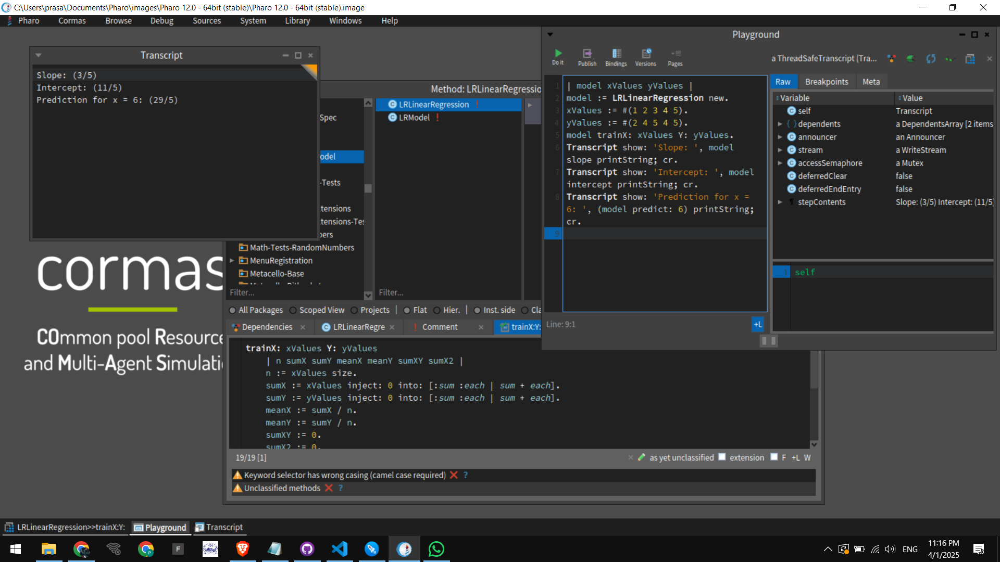

# Building a Simple Linear Regression Model in Pharo

## Introduction

Linear regression is one of the simplest yet most powerful machine learning algorithms. It is used for predicting numerical values based on input data. In this blog, we will explore how to implement a basic **Linear Regression** model in **Pharo** using **Cormas**.

This project covers:

- Implementing a simple linear regression model.
- Training the model using sample data.
- Making predictions based on the trained model.
- Running the model in the Pharo playground.

## Why Pharo?

Pharo is an elegant and interactive environment that simplifies object-oriented programming. With its live objects and dynamic typing, it is ideal for experimenting with machine learning algorithms like Linear Regression.

## Project Structure

The project consists of a **model package** that contains the core logic for linear regression:

```
LinearRegression-Model/
│── LRModel.st           # Abstract class for the model
│── LRLinearRegression.st # Implementation of Linear Regression
```

### **Model Components**

#### 1. `LRModel`

The abstract superclass for all models in this package.

#### 2. `LRLinearRegression`

This class implements the core logic for linear regression. It includes:

- A method to **train** the model using input data.
- A method to **predict** new values.
- Getters for retrieving model parameters (`slope` and `intercept`).

## Implementing the Model

### 1. **Defining the Linear Regression Model**

We start by creating `LRLinearRegression`, which will hold the **slope** and **intercept** values.

```smalltalk
Object subclass: #LRLinearRegression
    instanceVariableNames: 'slope intercept'
    classVariableNames: ''
    package: 'LinearRegression-Model'.
```

### 2. **Training the Model**

The `trainX:Y:` method takes **xValues** (input features) and **yValues** (target values), computes the best-fit line, and stores the slope and intercept.

```smalltalk
LRLinearRegression methodsFor: 'training'!
trainX: xValues Y: yValues
    | n sumX sumY meanX meanY sumXY sumX2 |
    n := xValues size.
    sumX := xValues inject: 0 into: [:sum :each | sum + each].
    sumY := yValues inject: 0 into: [:sum :each | sum + each].
    meanX := sumX / n.
    meanY := sumY / n.
    sumXY := 0.
    sumX2 := 0.
    1 to: n do: [:i |
        | xi yi |
        xi := xValues at: i.
        yi := yValues at: i.
        sumXY := sumXY + ((xi - meanX) * (yi - meanY)).
        sumX2 := sumX2 + ((xi - meanX) squared).
    ].
    slope := sumXY / sumX2.
    intercept := meanY - (slope * meanX).
!
```

### 3. **Making Predictions**

Once the model is trained, we can use the `predict:` method to estimate the value of `y` given a new `x`.

```smalltalk
LRLinearRegression methodsFor: 'prediction'!
predict: x
    ^ intercept + (slope * x)
!
```

### 4. **Accessing Model Parameters**

Getters for `slope` and `intercept`.

```smalltalk
LRLinearRegression methodsFor: 'accessing'!
slope
    ^ slope
!

intercept
    ^ intercept
!
```

## Running the Model

### Playground Code

You can test the implementation using the Pharo **Playground**:

```smalltalk
| model xValues yValues |
model := LRLinearRegression new.
xValues := #(1 2 3 4 5).
yValues := #(2 4 5 4 5).
model trainX: xValues Y: yValues.
Transcript show: 'Slope: ', model slope printString; cr.
Transcript show: 'Intercept: ', model intercept printString; cr.
Transcript show: 'Prediction for x = 6: ', (model predict: 6) printString; cr.
```

### Expected Output

```
Slope: 0.6
Intercept: 2.4
Prediction for x = 6: 6.0
```

## 📸 Screenshots




## Challenges Faced

1. **Handling Floating-Point Precision**: Ensuring correct rounding and numerical stability.
2. **Optimizing Performance**: Using efficient iteration methods for calculations.
3. **Validating Input Data**: Ensuring xValues and yValues arrays have the same size.

## Future Improvements

- Implementing **Multiple Linear Regression**.
- Adding visualization support using **Morphic UI**.
- Creating a GUI to **input data** dynamically.

## Conclusion

This project demonstrates how to implement a simple **Linear Regression** model in **Pharo** using **Smalltalk**. It provides an intuitive way to learn about machine learning, object-oriented programming, and data modeling.

By following this approach, you can build more advanced models and extend this project into a complete **ML toolkit** in Pharo!

---

If you found this interesting and want to contribute, check out the [**GitHub repository**](https://github.com/PrasannaPal21/Pharo-LinearRegression)! 🚀

HappyCoding 🚀 | Everything is an Object 😉.
