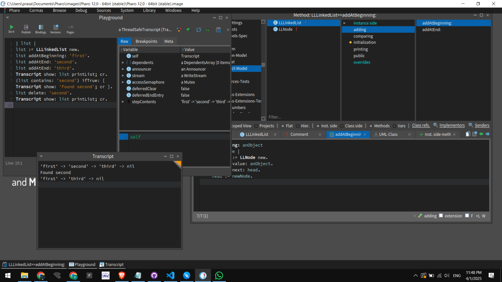

# Building a Linked List in Pharo

## Introduction
A **Linked List** is a fundamental data structure in computer science, allowing dynamic memory allocation and efficient insertions and deletions. In this blog, we will explore how to implement a **Singly Linked List** in **Pharo**, a dynamic Smalltalk environment.

## Why Use Pharo?
Pharo provides a live programming experience, making it an excellent choice for understanding object-oriented programming. Its interactive debugger and inspector tools help visualize data structures like linked lists in real time.

## Project Structure
The project is organized into a single package:

```
LinkedList-Model/      # Holds the core linked list implementation
```

### **Model Components**
The model defines the structure and operations of the linked list:

1. **`LLNode`**: Represents a single node in the list, storing data and a reference to the next node.
2. **`LinkedList`**: The main class that manages node operations like insert, delete, and traversal.

## Implementing the Linked List
### 1. **Creating the Node Class**
Each node in the linked list contains:
- A `value` to store the data.
- A `next` pointer to the next node in the sequence.

```smalltalk
Object subclass: #LLNode
    instanceVariableNames: 'value next'
    classVariableNames: ''
    package: 'LinkedList-Model'.

LLNode >> initializeWithValue: aValue
    value := aValue.
    next := nil.
```

### 2. **Defining the Linked List Class**
The **LinkedList** class will manage the nodes and provide operations to manipulate them.

```smalltalk
Object subclass: #LinkedList
    instanceVariableNames: 'head'
    classVariableNames: ''
    package: 'LinkedList-Model'.

LinkedList >> initialize
    head := nil.
```

### 3. **Adding Elements**
To insert a new element at the end of the list:

```smalltalk
LinkedList >> add: aValue
    | newNode current |
    newNode := LLNode new initializeWithValue: aValue.
    head isNil ifTrue: [ head := newNode. ^self ].
    current := head.
    [ current next isNil ] whileFalse: [ current := current next ].
    current next: newNode.
```

### 4. **Displaying Elements**
To traverse and display all elements:

```smalltalk
LinkedList >> display
    | current |
    current := head.
    [ current isNil ] whileFalse: [
        Transcript show: current value printString; cr.
        current := current next.
    ].
```

### 5. **Deleting a Node**
To remove a node with a specific value:

```smalltalk
LinkedList >> remove: aValue
    | current previous |
    current := head.
    previous := nil.
    [ current isNil not ] whileTrue: [
        (current value = aValue) ifTrue: [
            previous isNil ifTrue: [ head := current next ]
                          ifFalse: [ previous next: current next ].
            ^self.
        ].
        previous := current.
        current := current next.
    ].
```

## Running the Linked List
To create and manipulate a linked list in Pharo, execute:

```smalltalk
| myList |
myList := LinkedList new.
myList add: 10.
myList add: 20.
myList add: 30.
myList display.
myList remove: 20.
myList display.
```

## Screenshots
Here are some screenshots showing the linked list operations in the Pharo Transcript:

**List Output**
   


## Challenges Faced
1. **Handling Edge Cases**: Ensuring deletion works when the head is the target node.
2. **Traversal Efficiency**: Keeping traversal operations optimized.
3. **Live Debugging**: Using the Pharo Inspector to visualize node connections.

## Future Improvements
- Implementing a **Doubly Linked List**.
- Adding **Sorting Algorithms** for better list organization.
- Enhancing UI to visualize linked list operations graphically.

## Conclusion
This project demonstrates the power of **Pharo's live programming** environment in building and debugging data structures like Linked Lists. Understanding linked lists in an interactive setting makes learning more intuitive and practical.

---
If you found this project useful, feel free to explore and contribute to our repository on [**GitHub**](https://github.com/PrasannaPal21/Pharo-LinkedList)! 🚀

HappyCoding 🚀 | Everything is an Object 😉.

