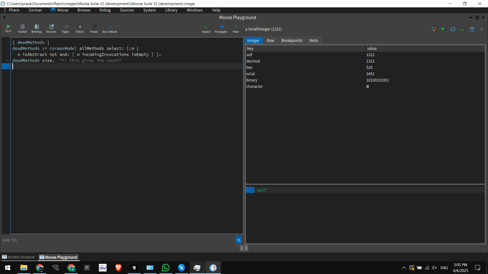
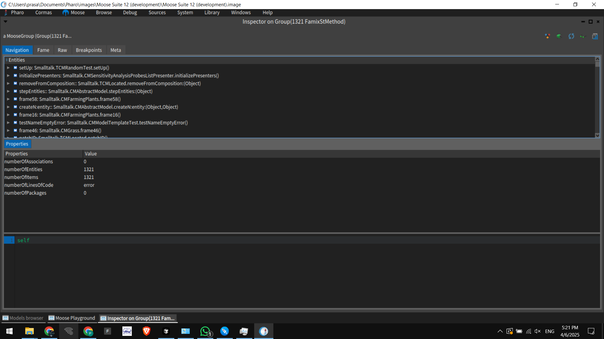

# 🧠 Analyzing the Cormas Codebase with Moose

> *A journey into understanding and improving legacy Smalltalk code with Moose – by [Prasanna](https://github.com/PrasannaPal21/)*

## 🧩 Introduction

Cormas (Common Resources for Agent-based and Multi-Agent Simulation) is a legacy agent-based modeling platform developed in Smalltalk. With over 25 years of development and multiple migrations, the codebase has evolved with contributions from many developers of varying backgrounds. This makes Cormas an ideal candidate for deep software analysis.

To better understand, refactor, and modernize the codebase, I began analyzing it using [Moose](http://moosetechnology.org/), a powerful platform for software and data analysis implemented in Pharo.

---

## 🛠️ Setup Steps

### 1. Installed Pharo and Moose
- Downloaded the Pharo Launcher.
- Created a Moose 13 image using the launcher.
- Launched Moose Analysis from the Pharo Launcher.

### 2. Cloned the Cormas Repository
- Cloned the [Cormas GitHub repository](https://github.com/CORMAS/Cormas) locally using Iceberg in Moose.
- Loaded all packages successfully **except** `Cormas-Pharo11`, which caused a conflict. Skipped this for the time being.

### 3. Imported Cormas into Moose
- After loading all packages via Iceberg, I verified the model by checking the number of imported entities.
- The model showed **52,277 entities**, confirming successful loading.

---

## 🧪 First Analysis: Dead Methods

Using the Moose Playground, I ran the following script to find *dead methods* — methods that are not abstract and have no incoming invocations:

```smalltalk
deadMethods := cormasModel allMethods 
	select: [:m | m isAbstract not and: [ m incomingInvocations isEmpty ]].
deadMethods size.
```

### 🔍 Results:
- Found **1,321 dead methods**.
- These methods could potentially be removed to reduce the maintenance burden and improve readability.
- Example methods include test methods, obsolete simulation steps, or UI-related stubs no longer used.

### 📸 


---

## 🧠 Planned Next Analyses

### 🔧 1. **God Class Detection**
- Identify large classes with too many responsibilities.
- Strategy: Use `numberOfMethods > threshold` as a quick filter.

### 🧪 2. **Test Coverage Check**
- Find classes with no corresponding `*Test` class.
- Plan to recommend unit test additions.

### 🧹 3. **Duplicate Code**
- Use the Duplication Browser to identify copy-pasted logic.

### 🗂️ 4. **Coupling & Cohesion**
- Use DSM (Dependency Structural Matrix) and Architectural Map to visualize and reduce tight inter-package coupling.

### 📈 5. **Blueprints & Complexity Maps**
- Leverage Moose visual tools like Class Blueprints and Distribution Maps to spot complexity hotspots.

---

## 🧭 Challenges Faced

- Metacello conflict errors when trying to load `Cormas-Pharo11`.
- Missing import options initially – had to learn that Moose automatically creates a model from Iceberg-loaded packages.
- Some visualizations (like dead code) required precise use of Moose API and playground queries.

---

## ✅ Conclusion

This initial exploration with Moose on the Cormas codebase has already yielded actionable insights, such as identifying over 1,300 unused methods. Future work will involve deeper visual and metric-based analysis to identify design flaws, architectural smells, and refactoring opportunities.

---

## 📷 Screenshots




---

## 📌 Final Thoughts

Analyzing legacy software like Cormas with Moose not only helps improve the maintainability of the system but also contributes to the evolution of software analysis tooling. Through this effort, I aim to assist the Cormas community in modernizing its codebase and making it more approachable for future developers.

HappyCoding 🚀 | Everything is an Object 😉.
