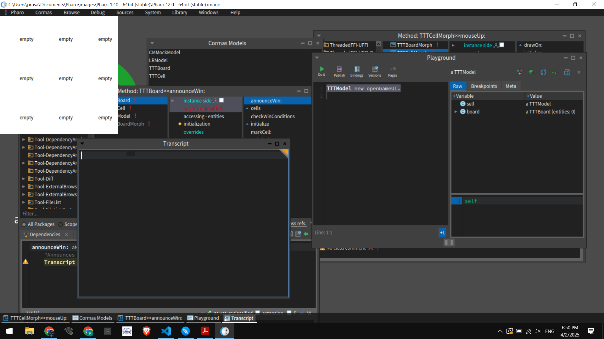
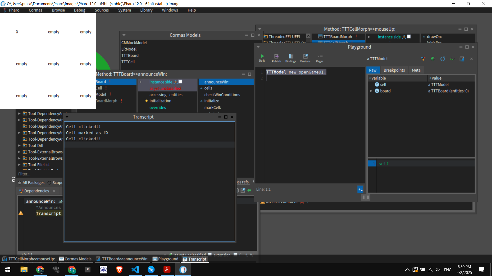
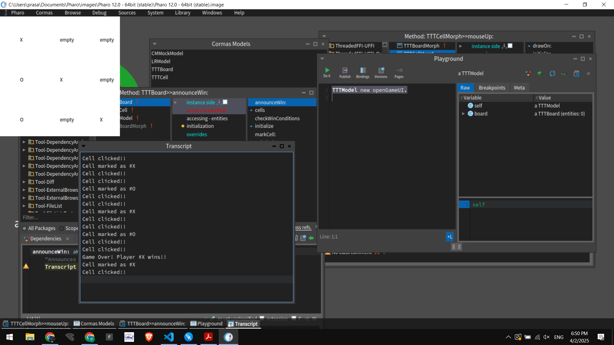

# Building a Tic-Tac-Toe Game in Pharo with Cormas

## Introduction
Tic-Tac-Toe is one of the most well-known classic games, often used as an introductory project for learning programming concepts. In this blog, we will explore how to build a Tic-Tac-Toe game using **Pharo** and **Cormas**, a powerful agent-based simulation framework. This project not only helps in understanding object-oriented programming but also provides a hands-on experience in UI design, event handling, and game logic in Smalltalk.

## Why Pharo and Cormas?
Pharo is a modern Smalltalk environment known for its dynamic and reflective programming capabilities. It provides an intuitive development experience with live objects, making debugging and experimentation easy.

Cormas is an agent-based modeling framework in Pharo, typically used for environmental and social simulations. However, its structured approach to defining models, entities, and interactions makes it an interesting choice for implementing a game like Tic-Tac-Toe.

## Project Structure
The project is organized into two main packages:

```
TicTacToeGame-Model/      # Holds the game logic and board representation
TicTacToeGame-UI/         # Handles the user interface and interaction
```

### **Model Components**
The model defines the logic of the game, including the board, individual cells, and game rules.

1. **`TTTModel`**: The main game class that manages the board and game flow.
2. **`TTTBoard`**: Represents the Tic-Tac-Toe board and contains 9 cells.
3. **`TTTCell`**: Represents a single cell in the grid, which can be `#X`, `#O`, or `#empty`.

### **UI Components**
The UI package provides a graphical interface to interact with the game.

1. **`TTTBoardMorph`**: The graphical representation of the Tic-Tac-Toe board.
2. **`TTTCellMorph`**: Represents an individual cell in the UI, handles user input, and displays the game state.

## Implementing the Game
### 1. **Creating the Game Model**
The first step in building the game is designing the **TTTBoard** class, which will contain the game state and logic. It includes:
- A collection of 9 `TTTCell` instances.
- A method to check for win conditions.
- A method to switch between players after a move.

```smalltalk
Object subclass: #TTTBoard
    instanceVariableNames: 'cells currentPlayer'
    classVariableNames: ''
    package: 'TicTacToeGame-Model'.

TTTBoard >> initialize
    cells := Array new: 9.
    1 to: 9 do: [:i | cells at: i put: TTTCell new].
    currentPlayer := #X.
```

### 2. **Implementing Game Logic**
A crucial part of the game is checking if a player has won after every move. We define the **checkWinConditions** method in `TTTBoard`:

```smalltalk
TTTBoard >> checkWinConditions
    | winCombos winner |
    winCombos := {
        {1. 2. 3}. {4. 5. 6}. {7. 8. 9}. "Rows"
        {1. 4. 7}. {2. 5. 8}. {3. 6. 9}. "Columns"
        {1. 5. 9}. {3. 5. 7}  "Diagonals"
    }.
    winCombos do: [:combo |
        | markers |
        markers := combo collect: [:i | (cells at: i) state].
        ((markers first ~= #empty) and: [ markers allSatisfy: [:m | m = markers first] ])
            ifTrue: [
                winner := markers first.
                self announceWin: winner.
                ^self  "Stop checking if a winner is found"
            ].
    ].
```

### 3. **Building the UI**
The graphical part of the game is handled by `TTTBoardMorph` and `TTTCellMorph`. Each `TTTCellMorph` represents a clickable cell on the board.

```smalltalk
TTTCellMorph >> mouseUp: anEvent
    "Handles click event. Marks the cell and updates the display."
    modelCell state = #empty ifTrue: [
        self owner board markCell: modelCell.
        self changed.
    ].
```

The **drawOn:** method is responsible for rendering the game board and displaying the player’s move.

```smalltalk
TTTCellMorph >> drawOn: aCanvas
    "Draws the state of the cell (X, O, or empty)."
    super drawOn: aCanvas.
    aCanvas drawString: modelCell state asString at: self bounds center.
```

## Running the Game
To start the game, execute:
```smalltalk
TTTModel new openGameUI.
```
This will open the Tic-Tac-Toe board where players can take turns clicking on cells to play the game.

## Screenshots
Here are some screenshots of the project in action:

1. **Initial Board State**
   

2. **Game in Progress**
   

3. **Game Over - Player Wins**
   

## Challenges Faced
1. **Handling Click Events**: Initially, clicking on a cell was dragging the entire board. This was fixed by disabling morph dragging.
2. **Updating the UI Dynamically**: The cell morphs were not updating immediately. This was resolved using `self changed.`
3. **Implementing Win Condition Checks**: Ensuring all possible win scenarios were properly detected.

## Future Improvements
- Implementing a restart button to reset the game.
- Adding animations for moves.
- Improving UI aesthetics with better styling.

## Conclusion
This project provided a great learning experience in **Pharo, Morphic UI, and Cormas**. It demonstrates the power of Smalltalk's live objects and message-passing paradigm in building interactive applications. Tic-Tac-Toe is a simple game, but the process of designing it from scratch offers deep insights into object-oriented design and event-driven programming.

---
If you found this interesting and would like to contribute or enhance the game, feel free to fork the repository on [**GitHub**](https://github.com/PrasannaPal21/Pharo-TicTacToeGame)! 🚀

HappyCoding 🚀 | Everything is an object
